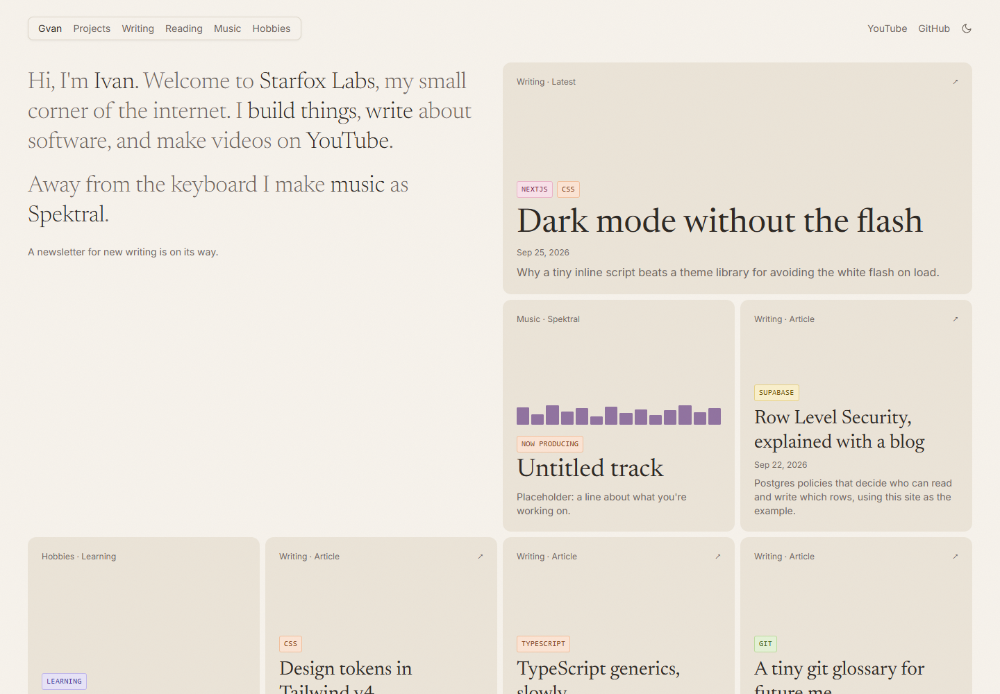
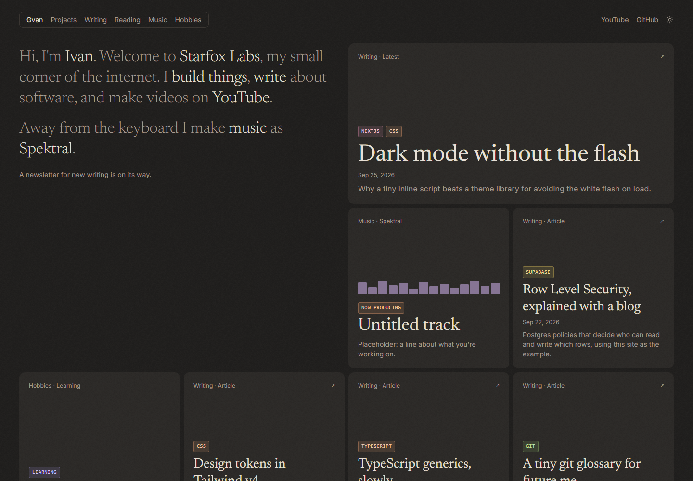
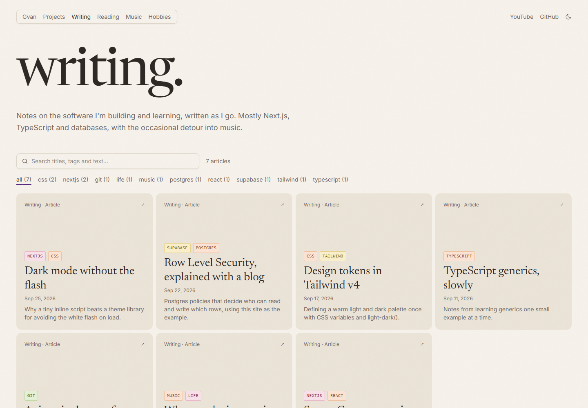
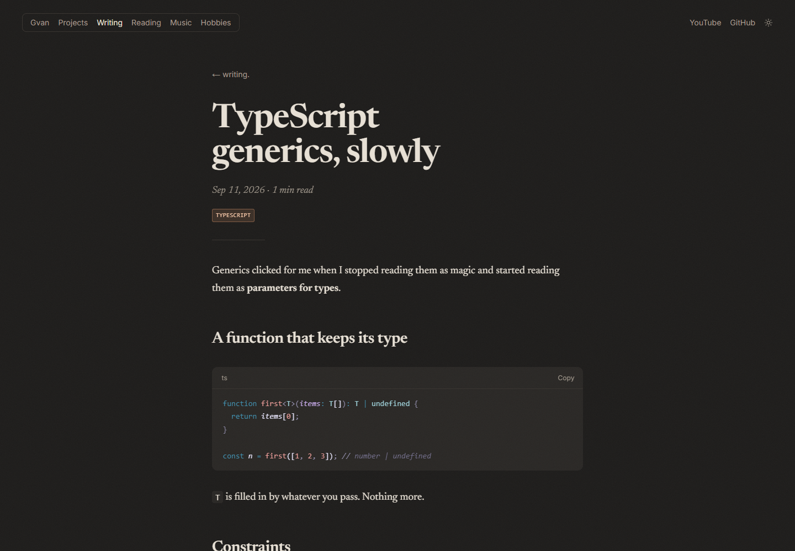
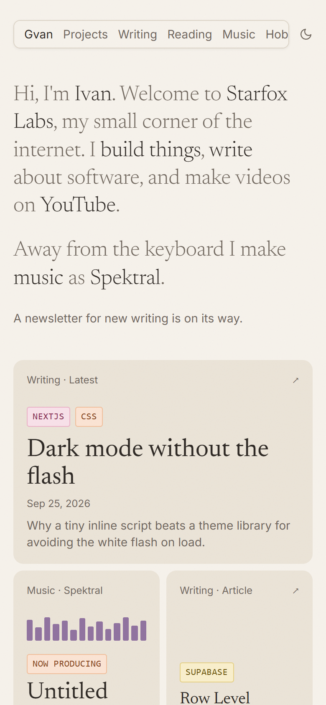

# Starfox Labs

My personal site at **[starfoxlabs.org](https://starfoxlabs.org)**: a "digital garden" of
writing about software, projects, books, games and music (I make music as Spektral).
Articles are written in an editor on the site itself and stored in Postgres, so posting
never means touching code.



| Dark mode | Writing | Article | Phone |
| --- | --- | --- | --- |
|  |  |  |  |

## What's built so far

- **Home**: a short intro next to a dense grid of cards (latest writing, what I'm producing
  and learning, my YouTube channel, tags with counts).
- **Writing** (`/writing`): every article as a card, with search as you type (titles,
  summaries, tags and full text), tag filters with counts, and "Load more".
  Filters live in the URL, so a filtered view can be shared.
- **Articles** (`/writing/[slug]`): a reading layout with syntax-highlighted code blocks
  (file names, highlighted lines, line numbers, a copy button), footnotes, a click-to-play
  YouTube player, older/newer links, and generated link-preview images.
- **Light and dark themes** that follow the system or a saved choice, with no flash of the
  wrong colors on load.
- Friendly **404 pages** that point somewhere useful.

The rest (admin editor, the Projects / Reading / Music / Games / Hobbies sections, reader
accounts, comments, newsletter) is on the [roadmap](#roadmap).

## Tech stack

| | |
| --- | --- |
| Framework | [Next.js 16](https://nextjs.org) (App Router, Cache Components), React 19, TypeScript |
| Styling | Tailwind CSS v4, design tokens in plain CSS |
| Data | [Supabase](https://supabase.com): Postgres with Row Level Security (Auth and Storage come next) |
| Markdown | unified / remark / rehype, [Shiki](https://shiki.style) via rehype-pretty-code |
| Images | `next/image`, link previews drawn with `next/og` |
| Hosting | Vercel, deployed from `main` |

## How it works

A few decisions worth explaining:

**Rendering and caching.** Pages are prerendered at build time and refreshed from cache,
using Next 16's Cache Components. Data functions in [`lib/posts.ts`](lib/posts.ts) are
marked `"use cache"` and tagged `posts`. Every published article is built ahead of time;
one published later is rendered on its first visit and then cached. Publishing from the
editor (phase 2) will refresh the `posts` tag so changes show at once. Work that reads the
clock or the file system (Shiki, the fonts for preview images) runs inside cached
functions too, otherwise Next quietly renders the route on every request.

**Security at the database.** Supabase exposes Postgres to the browser, so access rules
live in the database as [Row Level Security](supabase/migrations/20260926000000_create_posts.sql)
policies, not in the UI. Anyone may read *published* posts; drafts are invisible and
nothing can be written through the public key. I checked this with the public key
directly: 7 of 8 rows visible (the draft hidden), inserts rejected, updates and deletes
affecting nothing.

**Markdown on the server.** [`lib/markdown.tsx`](lib/markdown.tsx) turns an article's
markdown into React on the server: GitHub-flavored markdown, heading anchors, and syntax
highlighting in two themes that switch with the site theme through CSS variables. Readers
download finished HTML; there's no markdown parser or highlighter in the browser bundle.
Raw HTML in a post is dropped, so a post can't inject scripts. The one interactive piece,
the copy button, is a small client component placed into the rendered tree.

**Search that scales with daily posting.** The Writing page ships title, summary and tags
for every article (small), and the full article text comes from a separate prerendered
index that's only downloaded once someone starts typing. Typing updates the URL with
`history.replaceState` (so Back still leaves the page), while clicking a tag uses
`pushState`. When the index grows past about 1 MB, the plan is Postgres full-text search
(`tsvector` + GIN index behind an RPC).

**Themes without a flash.** Every color is a CSS variable holding both values through
`light-dark()`, and `color-scheme` picks one. A tiny inline script in `<head>` applies a
saved choice before the first paint; with no saved choice, CSS follows the OS.

**Accessibility.** Keyboard focus styles, a skip link, `prefers-reduced-motion` respected
(the one article fade-in is switched off), alt text on link-preview images, and
screen-reader announcements for search results.

## Project structure

```
app/                     Routes (App Router)
  page.tsx               Home grid
  writing/               Writing page, search index route, preview image
    [slug]/              Article page, its preview image and 404
  not-found.tsx          404 for any unknown address
  opengraph-image.tsx    Default link-preview image
  globals.css            Design tokens, prose and code-block styles
components/              UI pieces (cards, badges, header, search, code copy button…)
lib/                     Data access, markdown, search, preview images, site config
supabase/
  migrations/            Database schema and RLS policies (SQL)
  seed.sql               Sample articles for local development
assets/fonts/            Fonts for preview images (SIL Open Font License)
WRITING.md               Markdown cheat sheet for writing articles
CLAUDE.md                Project brief, design rules and build plan
```

## Running it locally

You'll need Node.js 20.9 or newer and a free [Supabase](https://supabase.com) project.

1. Install dependencies:
   ```bash
   npm install
   ```
2. Copy `.env.example` to `.env.local` and fill in your Supabase URL and **publishable**
   key (Supabase → Project Settings → API Keys). Never use the secret key here.
3. Create the database schema and sample content with the Supabase CLI (installed as a dev
   dependency):
   ```bash
   npx supabase login
   npx supabase link --project-ref <your-project-ref>
   npx supabase db push --include-seed
   ```
4. Start the dev server and open http://localhost:3000:
   ```bash
   npm run dev
   ```

| Command | What it does |
| --- | --- |
| `npm run dev` | Development server with hot reload |
| `npm run build` | Production build (must pass before pushing) |
| `npm run start` | Serve the production build |
| `npm run lint` | ESLint |
| `npm run db:types` | Regenerate `lib/database.types.ts` from the linked database |

### Environment variables

| Name | Purpose |
| --- | --- |
| `NEXT_PUBLIC_SUPABASE_URL` | Your Supabase project URL |
| `NEXT_PUBLIC_SUPABASE_PUBLISHABLE_KEY` | Supabase publishable key (safe in the browser; RLS decides access) |
| `NEXT_PUBLIC_SITE_URL` | Optional. Overrides `https://starfoxlabs.org` for canonical URLs and link previews |

## Roadmap

Built one phase at a time; the full plan is in [CLAUDE.md](CLAUDE.md#build-phases-build-one-phase-at-a-time).

- [x] **Foundation**: design system, home, writing, articles, link previews, 404s
- [x] **Admin**: sign-in for me only (with two-factor), and an editor for articles and every section
- [x] **Sections**: Projects, Reading, Music, Games, Hobbies
- [x] **Accounts and settings** for readers (optional)
- [x] **Comments**
- [ ] **Newsletter** with double opt-in (database ready; paused)
- [ ] **Polish**: latest YouTube videos, RSS and sitemap done; page transitions and an SEO pass next

## Credits

Design inspired by [chester.how](https://chester.how) (layout and card grid) and
[jmduke.com](https://www.jmduke.com) (tag filters, warm dark mode). Code and writing are my
own. Fonts: [Newsreader](https://github.com/productiontype/Newsreader) and
[Inter](https://github.com/rsms/inter), both under the SIL Open Font License. Song snippets
cut in the admin are encoded with [lamejs](https://github.com/shijinyu/lamejs) (`@breezystack/lamejs` (a
on npm; a JavaScript port of the LAME MP3 encoder, LGPL-3.0), used unmodified in its own Web Worker.
